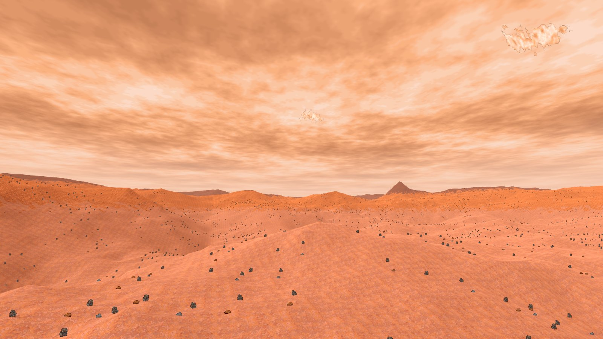
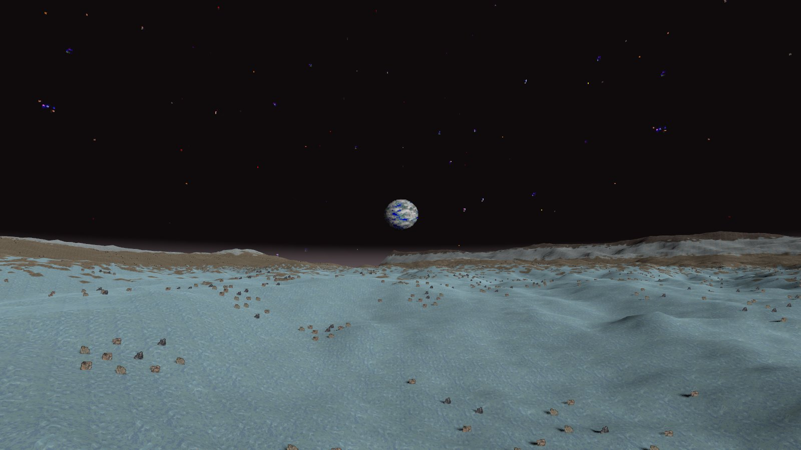
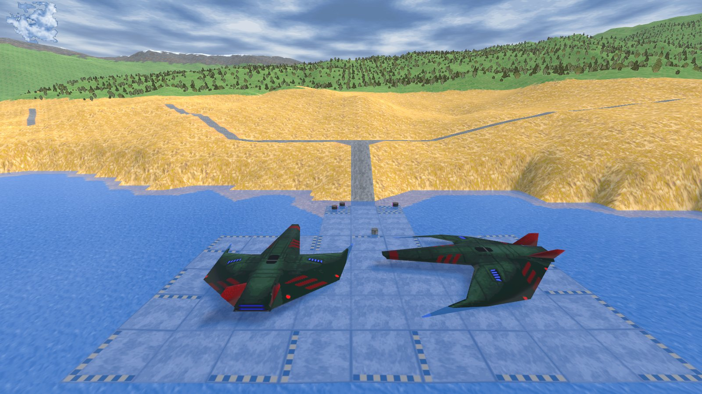
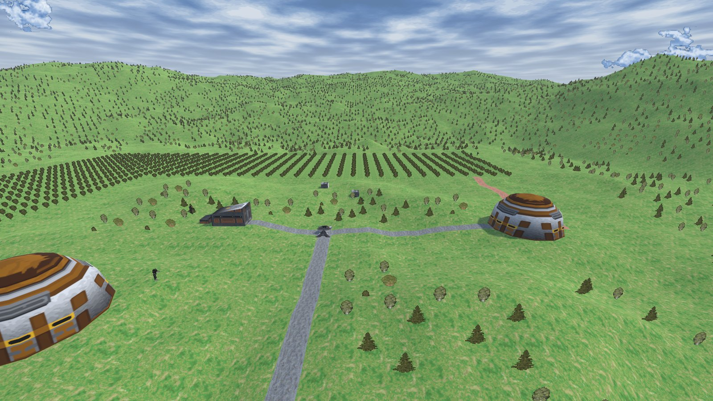
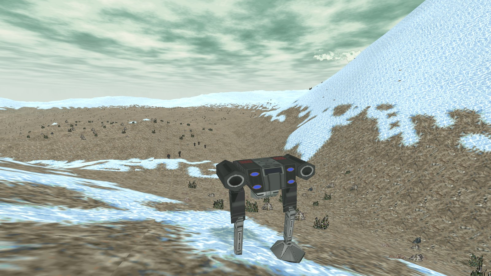
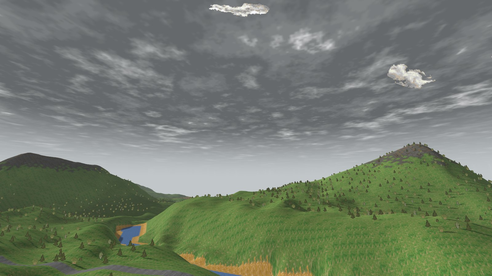
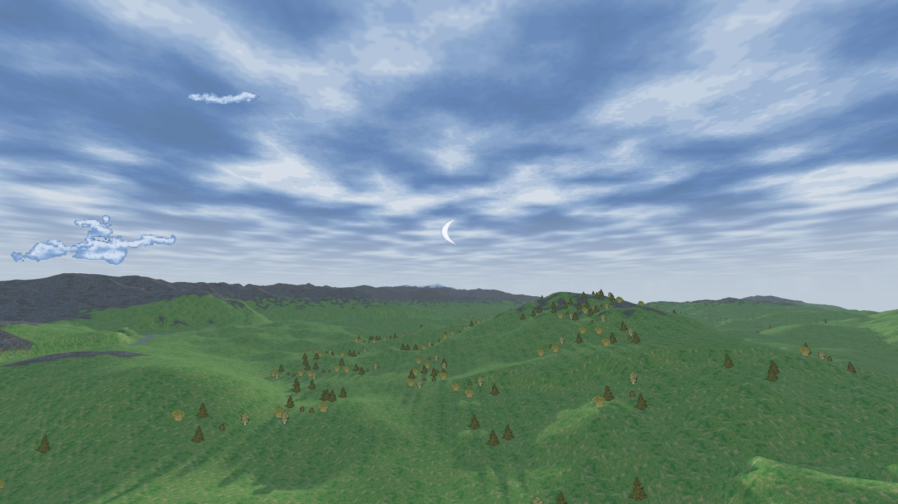
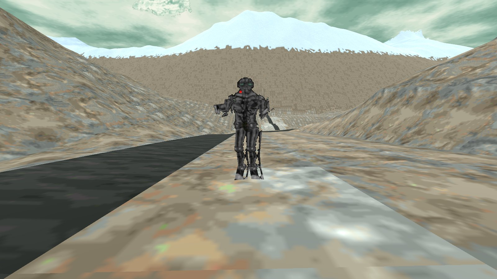
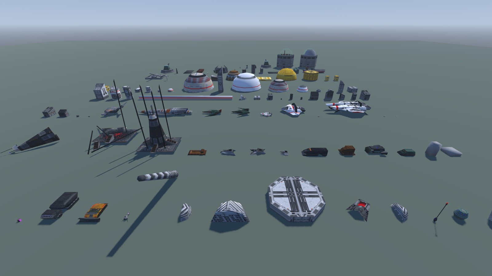

# Terra Nova Viewer

**A 3D map viewer for *Terra Nova: Strike Force Centauri*** (Looking Glass Technologies, 1996), made with Godot 4.7.

It reads the maps, missions, models and skies **straight from your own copy of the game** (GOG or Steam): nothing is copied, converted or shipped with it. Fly freely over all 37 campaign missions, the training maps, the cut missions, the mission generator's maps and the demos, and look at every object the way the engine draws it.

*Version française : [README.fr.md](README.fr.md).*

| | |
|---|---|
|  |  |
|  |  |
|  |  |
|  |  |

## Requirements & launch

1. *Terra Nova: Strike Force Centauri* installed (GOG or Steam).
2. [Godot 4.7](https://godotengine.org/download/windows/), **standard** version (not .NET). Just unzip it anywhere.
3. Download this repository (green **Code** button → **Download ZIP**) and unzip it.
4. Double-click **`Launch viewer.bat`**. It looks for Godot next to the viewer folder, on the `PATH`, in `C:\Tools\Godot`, or in the `GODOT` environment variable. You can also run `godot --path <viewer folder>` yourself.

The game is found automatically in the usual GOG and Steam folders. Otherwise the viewer asks for the game folder (the one that contains `TNOVA`) and remembers it.

The first time a map is opened, its ground orientation is computed and cached (1 to 7 s); afterwards maps open in a fraction of a second.

## Controls

| Key | Action |
|---|---|
| Right mouse button held + mouse | look around |
| WASD (QWERTY) / ZQSD (AZERTY) | move (physical keys) |
| Space / Ctrl | up / down |
| Shift | ×4 speed |
| Mouse wheel | change speed |
| Tab | mission list |
| F2 / F3 / F4 | labels / script zones / vegetation |

Object names come from your install, so they are in the language of your copy of the game.

## What you see

- **Terrain**: the detailed 513 × 513 map (1 unit between points) in the middle, surrounded by the coarse 257 × 257 grid (4 units) that makes the horizon, from −256 to 768. Water where a large flat area sits at the lowest level.
- **Ground textures**: the real 64 × 64 tiles of the planet file, one per cell, with transition tiles (shores, road edges, pad borders) turned the way the engine turns them — their orientation is not stored in the maps, it is worked out from the neighbouring cells.
- **3D objects**: vehicles, ships, buildings and props with their real models and textures, placed, turned and scaled as in the game (the bridge of *Operation Eagle's Nest* does span its ravine).
- **Power suits**: drawn like the game does — a skeleton whose limbs are sprites stretched between two joints, the view picked from the camera angle — in a standing pose computed by the game itself (read from memory). The biped mech is built from its small 3D parts.
- **Forests**: generated like the engine does from each map's vegetation map, with the game's tree, bush and rock sprites at their engine size.
- **Skies**: each mission's own sky — blue, storm, green, orange, or airless space with the game's star field — with its clouds, sun, moon and planets placed where the sky file puts them, the map's own light direction, and a haze that matches the fog.
- **Smoke columns**: the game's animated translucent smoke.
- **Script zones**: named mission points (drop points, triggers, "mystery pt"...) as yellow posts (F3).
- **61 entries**: 37 campaign missions, 2 training missions, the cut missions 40 and 41 (shown on the generator's flat terrain, their maps no longer exist), 16 mission generator templates, 4 demo missions (if the demos are installed).
- **Gallery** (last entry of the list): the 119 distinct 3D models of the game, with their file name and the object types that use them.

Easter egg spotted while making this: the "Stone head" prop is a model called `easter` — five Easter Island heads stand in a circle on the red planet in *Operation Pigpen* (campaign mission 34, `MISS25.RES`, around 186, 262).

## Command line (for screenshots and tests)

`godot --path . -- [options]`

| Option | Meaning |
|---|---|
| `--mission "05 "` | open the entry whose label contains this text (or a file name, e.g. `MISS17.RES`) |
| `--cam x,y,height,yaw,pitch` | camera position (map units, height above the ground) and angles in degrees |
| `--clean` | no labels, zones, panel or help line |
| `--shot file.png` | save a screenshot and quit |
| `--all` | load every entry once and quit (test) |

## File formats (reverse engineered)

Everything below was worked out for this viewer from the game files and from the game's own code (`__FF.EXE`). Memory addresses refer to the running game (GOG version, as loaded by DOSBox).

| File / resource | Contents |
|---|---|
| LG Res v2 | 128-byte header, directory offset at 0x7C; entries: u16 id, 24-bit size + flags, 24-bit compressed size + type |
| MAPx.RES 86 | 513 × 513 × 3 bytes: ground type, s16 height (× 0.6875 / 256) |
| MAPx.RES 85 | 257 × 257 × 3 bytes, same format, step 4, offset 256 |
| MAPx.RES 80 | planet file name (`resplntN.res`) |
| MAPx.RES 82 | light: u16 azimuth, s16 elevation (1/65536 turn) — the engine also draws the sky's moon there; then 2 words not decoded |
| MAPx.RES 83 | vegetation map, 128 × 128 bytes stored column by column (index = x × 128 + y), 4 × 4-unit cells; value v > 0 → list 119 + v |
| MAPx.RES 84 | 30 ground type names (16 bytes) |
| MAPx.RES 120-149 | 30 vegetation lists (50-byte entries: class, type, X/Y offsets in 16.16, 0 to 4 inside the cell) |
| RESPLNTn 48 | 64 × 64 ground tiles one after the other (4096 bytes each; 64 tiles, 53 and 59 on planets 2 and 3) |
| RESPLNTn 43 | tile → material (64 entries) |
| RESPLNTn 47 | material → first tile, number of variants |
| RESPLNTn 46 | transition table: index = materialA × 50 + materialB × 5 + shape → tile |
| RESPLNTn 49 | the 64 tiles at 16 × 16 (low resolution) |
| RESPLNTn 50 | palette: 239 RGB colors from index 17 |
| RESPLNTn 51 | material names (water, sand, grass, rock, snow, grass2, road, concrete, cliff, rock2) |
| RESPLNTn 53-57 | shading tables (16 / 8 / 16 / 8 / 5 levels × 256 colors) |
| RESTNOBJ 1343-1362 | 3D models, several per resource (see below) |
| RESTNOBJ 1160-1163 | tree, bush and rock sprites (LG bitmaps: type 2 raw, type 4 RSD run-length) |
| RESTNOBJ 1164-1193 | effect animations (explosions, fire, smoke; type 5 = translucent: 248 / 249 = light / dense smoke through the translucency tables) |
| RESTNOBJ 1196-1342 | model textures |
| RESTNOBJ 1371 / 1372 / 1373 / 1374 | object type → model or sprite for classes 0 (props), 2 (vehicles), 3 (aircraft), 4 (buildings): ref = u16 frame, u16 resource; props and buildings have 2 refs per type (intact, destroyed) |
| RESTNOBJ 1364 + class | per-type properties: collision shape (u16 kind, u16 index of the radius / height entry, 8-byte entries) |
| RESMAP.RES 1440 | global texture number → ref (resource, frame) |
| RESGAME / helmet files | palette colors 0-16 (fixed; a blue-grey ramp also used by planet 3's ground); the planet supplies 17-255 |
| MISSx.RES 170 / 172 / 173 / 176 / 177 | map / groups / entities (50 bytes: class, type, … x, y, z in 16.16 at 8 / 12 / 16, u16 heading at 20; z = height above the ground, 0 everywhere except the *Eagle's Nest* bridge) / zone positions / zone names |
| MISSx.RES 178 | sky file name (16 bytes), then mission parameters (copied to 0x4424D4: +0x13 view distance, +0x15 gravity 16.16 — 0.6 on the moon —, +0x1D / +0x1F cloud wind direction and speed) |
| SKYn.RES 152 | pictures: 0 = 256 × 256 cloud texture (absent on SKY3 / SKY4), then clouds, sun, moons, planets |
| SKYn.RES 153 | layout: u16 count, u8 base color; 0x04 cloud texture ref, 0x0C u16 star field resource, 0x14 moon ref; from 0x20 12-byte items: u16 azimuth, u16 elevation (1/65536 turn), ref (frame, 152), 4 bytes |
| SKYn.RES 150 / 151 | haze tables (16 × 256 / 8 × 256 colors); level 15 of 150 = fully hazed color |
| SKYn.RES 154 (SKY3 / SKY4) | wrapping 512 × 320 star field: 32 × 40 cells of 16 × 16 px (the last 20 rows repeat the first 20), u16 offset per cell (0 = empty), then per cell a list of small bitmaps ended by 0xFF: position (y << 4 \| x), size (w << 4 \| h), record length, w × h colors |

### Ground tile orientation

Tile of a map point: `byte & 0x3F`. Bit 7 (~57 % of points) is not an orientation and bit 6 is never set: the orientation is not stored, it follows from the materials of the 8 neighbouring cells. This holds for the transition tiles of table 46, and also for the "one-sided" tiles of a single material (road edge triangles, striped pad borders, corners): their own-material part (told apart with the plainest tile of that material) faces the cells of the same material.
The viewer makes a first guess from the neighbours' materials, repeats it using the neighbours' chosen orientation until nothing changes (a diagonal road made only of transition tiles settles step by step from its ends), then polishes the transition tiles by edge color continuity.

### 3D models

A model is a program for the Looking Glass 3D interpreter (the same family as System Shock's); the opcode sizes were read from the game's interpreter (jump table at 0x36069C). Header: name (8 bytes), bounding box and radius in 16.16, number of polygons (0x40), points (0x42), parameters (0x44), hot points (0x47, 16 bytes each from 0x5E), textures (0x49, 10 bytes each after them: byte 1 = local number, u16 at 2 = global number), size (0x4A), code start (0x4E).
Model axes: y down (objects stand on y = 0 and rise into negative y), z forward.
Useful opcodes: 03 / 15 / 16 / 21 define points, 0A-0F relative points (offset on 1 or 2 axes), 06 = BSP node (two sub-programs), 10-12 = articulated part (turret, gun), 28 / 29 = part with its own matrix, 14 = subroutine, 33 = polygon with its normal (sub-opcode 0 flat, 1 wireframe, 2 textured with u, v in 16.16), 04 = flat polygon, 26 = textured polygon, 24 / 25 / 1D = texture coordinates, 05 = color. Flat polygon color: bit 0x8000 = palette index, otherwise a color given at run time (alarm light). The stored normal, not the vertex order, decides which side is visible: mirrored parts can be wound backwards.
Sprites: the engine makes them 2 × the type's collision radius wide; the height follows the picture's proportions.

### Power suits

Soldier type → suit number: byte at 0x395CA5 + 70 × type (SFC light / standard / heavy 0-2, Hog 3, Hog scout 4, Hog heavy 5, clones 6-8, pirate 9, captain 10, biped mech 11).
Suit s → RESTNOBJ 800 + 7 s + part (0 foot, 1 shin, 2 thigh, 3 upper arm, 4 forearm, 5 torso, 6 other forearm). A part: u8 number of views (16 all around, 9 from back to front for the torso), u16 length in pixels between its two joints at 9 (byte 12 is a flag), view offsets (u32 from 13); each view is an LG bitmap whose bytes 16-19 give the position of the two joints in the picture.
Skeletons: 884 (most suits), 885 (clones, pirates: 7th part), 886 (biped mech, whose parts are the 3D models 877-883); byte 1 = number of segments, 16-byte segments from 0x14: joint a, joint b, chain, flags, u16 part. 16 joints: 0/1 toes, 2/3 ankles, 4/5 knees, 6/7 hips, 8 pelvis, 9 neck, 10/11 shoulders, 12/13 elbows, 14/15 hands.
In game, bone length = pixels / 256 × the soldier's own size (random, about ±12 %). No pose is stored: the game computes the walk when drawing (0x280934) and keeps the 16 joints (x, y, z in 16.16, z up) at +0x1AF of the soldier record (0x3A56B8 + 0x582 × n, n = word at +3 of the master table entry; suit number at +0xDE). `data/soldier_poses.json` holds poses read there (joints as right, up, forward, ground at 0); the viewer uses the Hog scout's standing pose for the other suits, with their own bone lengths.

## To do

- Soldier walk animation; feet resting on slopes; turrets aimed.
- Mission parameters (cloud wind, gravity…) and the exact scale of the star field.

## Legal

A fan-made tool, not affiliated with or endorsed by the game's rights holders. It contains **no game data**: you need your own copy of *Terra Nova: Strike Force Centauri*. The screenshots show the game's own assets, rendered from a legally owned copy.

Code under the [MIT License](LICENSE).
